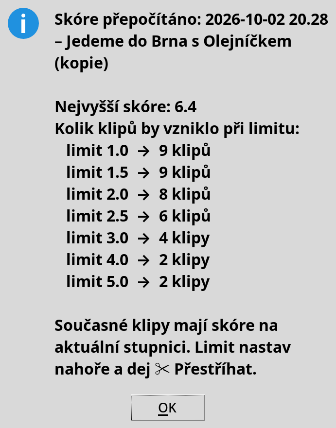

# ClipFarm

Automatické highlight klipy ze streamů. Vložíš odkaz na YouTube video nebo živý stream z Kicku, ClipFarm ho
stáhne (nebo nahrává), podle reakcí chatu a hlasitosti najde nejlepší momenty a nastříhá z nich klipy – na šířku,
nebo na výšku pro Shorts a TikTok. Funguje na Linuxu, Windows i macOS a ovládá se z jednoho okna.


## Rychlý start

1. **Nainstaluj** (jednou): Linux `bash instalace-linux.sh`, Windows dvojklik na `instalace-windows.bat`,
   macOS dvojklik na `instalace-macos.command`. Podrobnosti v [Instalace](#instalace).
2. **Otevři ClipFarm** z nabídky aplikací (Linux), plochy / nabídky Start (Windows) nebo Launchpadu (macOS).
3. **Vlož odkaz** – YouTube video nebo `https://kick.com/<kanál>` – a zmáčkni **▶ Spustit**.
4. Hotové klipy najdeš v kartě **Klipy**, dvojklik je přehraje.

## Co umí

- **YouTube** video nebo záznam streamu: stáhne video (max. 720p) i záznam chatu, pokud existuje.
- **Kick** živý stream: nahrává video i chat, dokud stream neskončí, nebo po nastavenou dobu (časovač),
  nebo dokud nezmáčkneš **Ukončit a nastříhat**. Nahrávání běží dál i po zavření okna.
- **Výběr momentů** podle reakce chatu (spam jednoho člověka se nepočítá) a hlasitosti – viz
  [Jak vybírá momenty](#jak-vybírá-momenty).
- **Klipy** začínají na střihu scény nebo v pauze mezi slovy a končí, až reakce opadne (typicky 20–60 s).
  Na šířku 16:9, nebo **na výšku 9:16** (Shorts, TikTok, Reels) s rozmazaným pozadím.
- **Přepočet skóre a přestříhání** už staženého streamu s jiným limitem nebo formátem, bez nového stahování.
- **Neuspává počítač**, dokud něco běží (na Linuxu i po zaklapnutí víka).
- **Prohlížení v prohlížeči** přes vestavěný server `http://127.0.0.1:8765/`, který funguje i s prohlížečem
  ve Flatpaku nebo po přesunutí složky.

## Instalace

Potřebuje Python 3.12+, [yt-dlp](https://github.com/yt-dlp/yt-dlp), ffmpeg a Node.js (yt-dlp ho používá
na YouTube). Instalační skripty doinstalují jen to, co chybí, a spustí ClipFarm. Ten si při prvním spuštění
vytvoří ikonu.

| Systém | Instalace | Kde je pak ikona |
|---|---|---|
| **Linux** (Fedora, Ubuntu/Debian, Arch) | `bash instalace-linux.sh`, nebo v Souborech pravým tlačítkem → Spustit jako program | nabídka aplikací (Super → ClipFarm) |
| **Windows** 10/11 | dvojklik na `instalace-windows.bat` (přes winget), pak dvojklik na `ClipFarm.py` | plocha a nabídka Start |
| **macOS** | dvojklik na `instalace-macos.command` (přes Homebrew) | Launchpad, `~/Applications/ClipFarm.app` |

Po přesunutí složky spusť `ClipFarm.py` jednou ručně, ať ikona ukazuje na nové místo.

## Okno

**Nahoře** je pole pro odkaz a **▶ Spustit**. Pod ním nastavení, které platí pro spuštění i pro přestříhání:

- **Limit skóre** – jak výrazný musí moment být, aby z něj vznikl klip (výchozí 2,5; víc = méně a lepších klipů),
- **Nahrávat živák** – „dokud neskončí“, 30 min, 2 h… nebo vlastní, třeba `1 h 30 min`,
- **Klipy na výšku 9:16** – pro Shorts, TikTok a Reels.

### Karta Běží


- Všechno, co běží – i spuštěné z terminálu: jak dlouho, **odpočet do konce** nahrávání, kolik je nahráno.
- **⏹ Ukončit a nastříhat** – ukončí nahrávání živáku a hned nastříhá, co je nahrané.
- **Změnit konec** + **⏱ Nastavit** – časovač i u nahrávání, které už běží (prodloužit, zkrátit, „dokud
  neskončí“).
- **■ Stop** – objeví se jen u vybraného přestříhání nebo přepočtu skóre a zastaví ho; hotové klipy zůstanou.
- **Neuspávat počítač** a dole log vybrané úlohy.

### Karta Klipy

- Streamer → stream → **zdrojové video** (`stream.mp4`) a **klipy** s časem ve streamu, délkou a skóre.
  Vidět je každá složka s videem, i nedokončená nebo bez klipů. Dvojklik přehraje.
- **✂ Přestříhat** – znovu nastříhá stream s aktuálním limitem a formátem, bez stahování (použije uložený
  chat). Staré klipy se nahradí, až budou nové hotové.
- **Σ Přepočítat skóre** – nic nestříhá, jen ukáže, kolik klipů by dal který limit, a přepočítá skóre
  současných klipů na aktuální stupnici:

  

- **Složka**, **V prohlížeči**, **Smazat zdroj** (uvolní místo, klipy zůstanou, ale stream už nepůjde
  přestříhat), **Smazat** (klip nebo celý stream).

### Typický postup

1. Živák: vlož `https://kick.com/<kanál>`, nastav **Nahrávat živák** (třeba 3 h) a **▶ Spustit**. Můžeš
   odejít – po čase nebo s koncem streamu se klipy nastříhají samy.
2. Málo nebo moc klipů? V kartě Klipy vyber stream → **Σ Přepočítat skóre** → podle tabulky nastav nahoře
   **Limit skóre** → **✂ Přestříhat**.
3. Na TikTok: zaškrtni **Klipy na výšku 9:16** a dej **✂ Přestříhat**.

## Terminál

Všechno jde i bez okna přes `Klipy.py`:

```bash
python3 Klipy.py <odkaz | složka streamu> [limit skóre] [minuty nahrávání živáku]

python3 Klipy.py "https://www.youtube.com/watch?v=..."              # stáhnout a nastříhat
python3 Klipy.py https://kick.com/lukyonair1 2.5 90                # nahrávat 90 min, pak nastříhat
python3 Klipy.py "klipy/lukyonair1/2026-10-02 16.50 – …" 1.5       # přestříhat s nižším limitem
python3 Klipy.py --skore "klipy/lukyonair1/2026-10-02 16.50 – …"    # jen přepočítat skóre
CLIPFARM_VERTICAL=1 python3 Klipy.py "https://…"                    # klipy na výšku 9:16
```

Ctrl+C během nahrávání = ukončit a nastříhat, co je nahrané.

## Co vznikne

```
klipy/
├── index.html                          ← přehled všech streamů
├── _logy/                              ← logy a stav běžících úloh (pro okno)
└── <kanál>/<datum [čas] – název>/
    ├── 01.mp4, 02.mp4, …               ← klipy
    ├── index.html                      ← stránka streamu s klipy
    ├── klipy.json, info.json           ← data pro okno, přestříhání a přepočet skóre
    ├── stream.mp4                      ← zdrojové video (dá se smazat, pak už nejde přestříhat)
    └── stream.live_chat.json           ← chat (YouTube záznam nebo nahraný Kick chat)
```

Složka `klipy/` je vždy vedle `Klipy.py`, ať ho spustíš odkudkoli. Vlastní video jde zpracovat taky: dej ho do
`klipy/<kanál>/<datum – název>/stream.mp4` a v okně dej **✂ Přestříhat**.

## Jak vybírá momenty

Pro každou sekundu streamu se spočítá **skóre**: o kolik směrodatných odchylek (σ) je moment výraznější než
běžný stav streamu.

- **Chat:** zprávy během 10 s po momentu (diváci reagují se zpožděním). Každý člověk se počítá nejvýš jednou
  za 10 s. Bonus za `KEKW`, `xddd`, `LUL`, `???`, 😂… jen když je během ~10 s napíšou aspoň **3 různí lidé**.
- **Zvuk:** hlasitost (smích, křik) kolem momentu.
- Obojí se porovnává s okolím **60 s před a 60 s po**. Krátký výkyv tak vyjde vysoko, trvalá změna
  (přepnutí scény, konec pauzy) ne. Druhé měřítko hledá **delší vzrušené pasáže** (30 s oproti 2 min okolí).
- Klip vznikne z každého momentu nad **limitem skóre**, aspoň 2 min od sebe, počet není omezený.

**Hranice klipu:** začátek na poslední změně scény 8–30 s před momentem (jinak 22 s před ním), konec až
reakce opadne (8–40 s po momentu), na střihu scény nebo v pauze mezi slovy. Ticho delší než 1,5 s (černá
obrazovka, pauza streamu) uvnitř klipu nikdy není.

Všechny hodnoty jsou konstanty nahoře v `Klipy.py` (`MIN_SCORE`, `GAP`, `AROUND`, `BEFORE`, `MAX_AFTER`,
`HYPE`, `HYPE_AUTHORS`…).

## Omezení

- **VODy na Kicku** jsou často jen pro předplatitele a stáhnout nejdou. Živý stream je veřejný, proto
  ClipFarm nahrává živě (od chvíle spuštění, ne od začátku streamu).
- **Bez chatu** (YouTube reuploady, nahraná videa) rozhoduje jen zvuk a výsledky jsou slabší; pro taková
  videa limit sniž (např. 1,5) – správnou hodnotu ukáže **Σ Přepočítat skóre**.
- **Prolínačka mezi scénami bez ztišení** se pozná jen podle obrazu, ne vždy. Výpadek streamu (BRB obrazovka)
  s „???“ v chatu může vypadat jako reakce.
- **Zaklapnutí víka:** na Windows ho řídí Nastavení napájení („Při zavření víka: Nic nedělat“), na macOS
  se Mac uspí, pokud není připojený monitor.
- Vyzkoušené hlavně na Linuxu (Fedora). Windows a macOS jsou ověřené typovou kontrolou a simulací, ne na
  skutečném stroji.

## Vývoj

```bash
python3 Klipy.py --test       # self-check: momenty, hranice klipů, chat, časovač, záchrana nahrávky, 9:16
python3 ClipFarm.py --test    # self-check okna: stav úloh, časovač, Stop, mazání, seznam videí, webový server
```

Bez závislostí mimo standardní knihovnu Pythonu (yt-dlp a ffmpeg se volají jako programy, Kick chat přes
vlastní minimální websocket klient).
