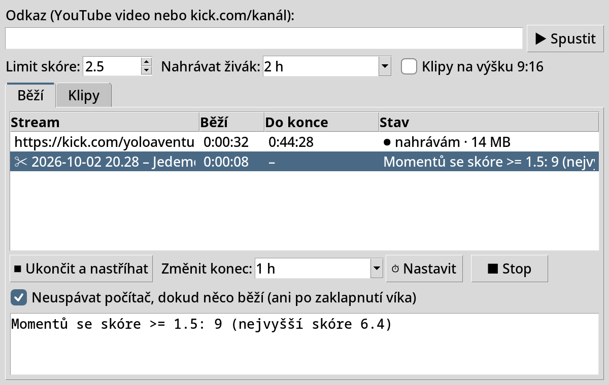
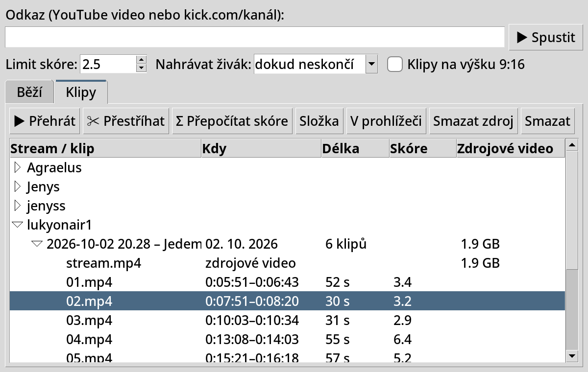

# ClipFarm

Automatické highlight klipy ze streamů. Vložíš odkaz na YouTube video nebo živý stream z Kicku, ClipFarm ho
stáhne (nebo nahrává), podle chatu a zvuku najde nejlepší momenty a nastříhá z nich klipy. Funguje na Linuxu,
Windows i macOS, ovládá se z jednoho okna.





## Co umí

- **YouTube** video nebo záznam streamu: stáhne video (max. 720p) i záznam chatu, pokud existuje.
- **Kick** živý stream (`https://kick.com/<kanál>`): nahrává video i chat, dokud stream neskončí,
  nebo po nastavenou dobu (časovač), nebo dokud nezmáčkneš **Ukončit a nastříhat**.
- **Výběr momentů** podle reakce chatu (spam jednoho člověka se nepočítá) a hlasitosti, viz níž.
- **Klipy** začínají na střihu scény nebo v pauze mezi slovy a končí, až reakce opadne (typicky 20–60 s).
  Na šířku 16:9, nebo **na výšku 9:16** (Shorts, TikTok, Reels) s rozmazaným pozadím.
- **Okno** na všechno: spuštění, přehled běžících nahrávání s odpočtem, časovač, přehrání klipu nebo
  zdrojového videa, přepočet skóre, přestříhání s jiným limitem, mazání. Nahrávání běží dál i po zavření okna.
- **Neuspává počítač**, dokud něco běží (na Linuxu i po zaklapnutí víka).
- **Prohlížení v prohlížeči** přes vestavěný server `http://127.0.0.1:8765/`, který funguje i s prohlížečem
  ve Flatpaku nebo po přesunutí složky.

## Instalace

Potřebuje Python 3.12+, [yt-dlp](https://github.com/yt-dlp/yt-dlp), ffmpeg a Node.js (yt-dlp ho používá
na YouTube). Instalační skripty doinstalují, co chybí, a spustí ClipFarm. Ten si při prvním spuštění vytvoří
ikonu.

| Systém | Instalace | Kde je pak ikona |
|---|---|---|
| **Linux** (Fedora, Ubuntu/Debian, Arch) | `bash instalace-linux.sh`, nebo v Souborech pravým tlačítkem → Spustit jako program | nabídka aplikací (Super → ClipFarm) |
| **Windows** 10/11 | dvojklik na `instalace-windows.bat` (přes winget), pak dvojklik na `ClipFarm.py` | plocha a nabídka Start |
| **macOS** | dvojklik na `instalace-macos.command` (přes Homebrew) | Launchpad, `~/Applications/ClipFarm.app` |

Po přesunutí složky spusť `ClipFarm.py` jednou ručně, ať ikona ukazuje na nové místo.

## Použití

### Okno (`ClipFarm.py`)

**Nahoře:** odkaz a **▶ Spustit**. Pod tím nastavení pro spuštění i přestříhání: **Limit skóre** (jak výrazný
musí moment být, výchozí 2,5), **Nahrávat živák** („dokud neskončí“, 30 min, 2 h… nebo vlastní, třeba
`1 h 30 min`) a **Klipy na výšku 9:16**.

**Karta Běží**

- všechno, co běží (i spuštěné z terminálu): jak dlouho, **odpočet do konce** nahrávání, kolik je nahráno,
- **⏹ Ukončit a nastříhat**: ukončí nahrávání živáku a hned nastříhá, co je nahrané,
- **Změnit konec** + **⏱ Nastavit**: časovač i u nahrávání, které už běží,
- **■ Stop**: objeví se jen u vybraného přestříhání nebo přepočtu skóre a zastaví ho (hotové klipy zůstanou),
- **Neuspávat počítač** a log vybrané úlohy.

**Karta Klipy**

- streamer → stream → zdrojové video (`stream.mp4`) a klipy (čas ve streamu, délka, skóre); vidět je každá
  složka s videem, i nedokončená nebo bez klipů; dvojklik přehraje,
- **✂ Přestříhat**: znovu nastříhá stream s aktuálním limitem a formátem bez stahování (použije i uložený
  chat); staré klipy se nahradí, až budou nové hotové,
- **Σ Přepočítat skóre**: nic nestříhá, jen ukáže, kolik klipů by dal který limit, a přepočítá skóre
  současných klipů na aktuální stupnici,
- **Složka**, **V prohlížeči**, **Smazat zdroj** (uvolní místo, klipy zůstanou), **Smazat**.

### Terminál (`Klipy.py`)

```bash
python3 Klipy.py <odkaz | složka streamu> [limit skóre] [minuty nahrávání živáku]

python3 Klipy.py "https://www.youtube.com/watch?v=..."              # stáhnout a nastříhat
python3 Klipy.py https://kick.com/lukyonair1 2.5 90                # nahrávat 90 min, pak nastříhat
python3 Klipy.py "klipy/lukyonair1/2026-10-02 16.50 – …" 1.5       # přestříhat s nižším limitem
python3 Klipy.py --skore "klipy/lukyonair1/2026-10-02 16.50 – …"    # jen přepočítat skóre
CLIPFARM_VERTICAL=1 python3 Klipy.py "https://…"                    # klipy na výšku 9:16
```

Ctrl+C během nahrávání = ukončit a nastříhat, co je nahrané.

### Co vznikne

```
klipy/
├── index.html                          ← přehled všech streamů
├── _logy/                              ← logy a stav běžících nahrávání (pro okno)
└── <kanál>/<datum [čas] – název>/
    ├── 01.mp4, 02.mp4, …               ← klipy
    ├── index.html                      ← stránka streamu s klipy
    ├── klipy.json, info.json           ← data pro okno a přestříhání
    ├── stream.mp4                      ← zdrojové video (dá se smazat, pak už nejde přestříhat)
    └── stream.live_chat.json           ← chat (YouTube záznam nebo nahraný Kick chat)
```

Složka `klipy/` je vždy vedle `Klipy.py`, ať ho spustíš odkudkoli.

## Jak vybírá momenty

Pro každou sekundu streamu se spočítá **skóre**: o kolik směrodatných odchylek (σ) je moment výraznější než
běžný stav streamu.

- **Chat:** zprávy během 10 s po momentu (diváci reagují se zpožděním). Každý člověk se počítá nejvýš jednou
  za 10 s. Bonus za `KEKW`, `xddd`, `LUL`, `???`, 😂… jen když je během ~10 s napíšou aspoň **3 různí lidé**.
- **Zvuk:** hlasitost (smích, křik) kolem momentu.
- Obojí se porovnává s okolím **60 s před a 60 s po**. Krátký výkyv tak vyjde vysoko, trvalá změna
  (přepnutí scény, konec pauzy) ne. Druhé měřítko hledá **delší vzrušené pasáže** (30 s oproti 2 min okolí).
- Klip vznikne z každého momentu nad **limitem skóre**, aspoň 2 min od sebe, počet není omezený.

**Hranice klipu:** začátek na poslední změně scény 8–30 s před momentem (jinak 22 s před ním), konec až
reakce opadne (8–40 s po momentu), na střihu scény nebo v pauze mezi slovy. Ticho delší než 1,5 s (černá
obrazovka, pauza streamu) uvnitř klipu nikdy není.

Všechny hodnoty jsou konstanty nahoře v `Klipy.py` (`MIN_SCORE`, `GAP`, `AROUND`, `BEFORE`, `MAX_AFTER`,
`HYPE`, `HYPE_AUTHORS`…).

## Omezení

- **VODy na Kicku** jsou často jen pro předplatitele a stáhnout nejdou. Živý stream je veřejný, proto
  ClipFarm nahrává živě (od chvíle spuštění, ne od začátku streamu).
- **Bez chatu** (YouTube reuploady, nesestříhaná videa) rozhoduje jen zvuk a výsledky jsou slabší; pro taková
  videa limit sniž (např. 1,5).
- **Prolínačka mezi scénami bez ztišení** se pozná jen podle obrazu, ne vždy. Výpadek streamu (BRB obrazovka)
  s „???“ v chatu může vypadat jako reakce.
- **Zaklapnutí víka:** na Windows ho řídí Nastavení napájení („Při zavření víka: Nic nedělat“), na macOS
  se Mac uspí, pokud není připojený monitor.
- Vyzkoušené hlavně na Linuxu (Fedora). Windows a macOS jsou ověřené typovou kontrolou a simulací, ne na
  skutečném stroji.

## Vývoj

```bash
python3 Klipy.py --test       # self-check výběru momentů, hranic klipů, chatu, časovače, záchrany nahrávky
python3 ClipFarm.py --test    # self-check okna: stav nahrávání, časovač, mazání, webový server
```

Bez závislostí mimo standardní knihovnu Pythonu (yt-dlp a ffmpeg se volají jako programy, Kick chat přes
vlastní minimální websocket klient).
